# Nexus — Platform Architecture Design

A centralized Progressive Web App (PWA) for the tech hub that unifies resource sharing, project management, progress tracking, class scheduling, messaging, and push notifications — all scoped by department with strict access control.

---

## 1. System Overview

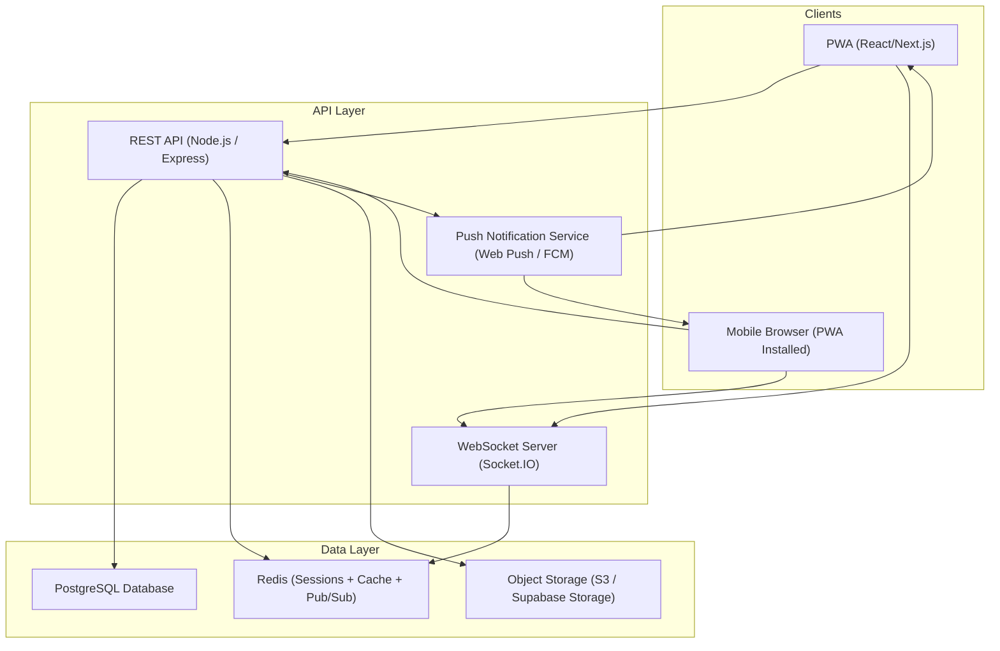

### Tech Stack Summary

| Layer | Technology | Rationale |
|---|---|---|
| **Frontend** | Next.js (React) + TypeScript | SSR, PWA support, file-based routing, strong ecosystem |
| **Styling** | Vanilla CSS + CSS Custom Properties | Full control, no framework lock-in |
| **State Management** | Zustand + React Query (TanStack Query) | Lightweight global state + server-state caching/sync |
| **Backend API** | Node.js + Express + TypeScript | JavaScript full-stack, fast development |
| **Database** | PostgreSQL | Relational integrity for roles/departments/projects, JSONB for flexibility |
| **ORM** | Prisma | Type-safe queries, migrations, schema-first design |
| **Real-time** | Socket.IO | WebSocket abstraction with rooms (department-scoped channels) |
| **File Storage** | Supabase Storage or AWS S3 | Scalable object storage for any file type |
| **Auth** | JWT (access + refresh tokens) + bcrypt | Stateless API auth with secure password hashing |
| **Push Notifications** | Web Push API (VAPID) + FCM fallback | Native push to mobile browsers, PWA-installed devices |
| **Caching/Pub-Sub** | Redis | Session management, Socket.IO adapter, notification queuing |
| **Deployment** | Docker + docker-compose | Reproducible, portable deployment for hackathon |

---

## 2. User Roles & Permissions

### 2.1 Role Hierarchy

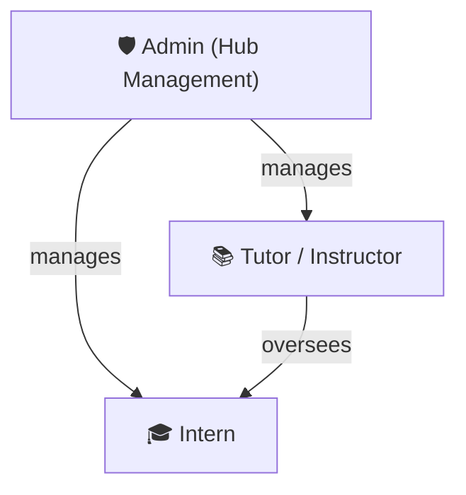

### 2.2 Permission Matrix

| Capability | Admin | Tutor | Intern |
|---|:---:|:---:|:---:|
| Create/manage departments | ✅ | ❌ | ❌ |
| Assign tutors to departments | ✅ | ❌ | ❌ |
| Approve intern registrations | ✅ | ✅ | ❌ |
| Upload resources | ✅ | ✅ | ❌ |
| Create announcements | ✅ | ✅ | ❌ |
| Schedule classes | ✅ | ✅ | ❌ |
| Create projects & assign groups | ✅ | ✅ | ❌ |
| Update project tasks/progress | ❌ | ✅ | ✅ (own tasks) |
| Submit completed work | ❌ | ❌ | ✅ |
| Give feedback on submissions | ✅ | ✅ | ❌ |
| Download department resources | ✅ | ✅ | ✅ |
| Send department messages | ✅ | ✅ | ✅ |
| View other departments | ✅ | ❌ | ❌ |
| Manage push notification prefs | ✅ | ✅ | ✅ |

> [!IMPORTANT]
> **Department Isolation is enforced at the API/middleware level.** Every API request that touches department-scoped data passes through a `departmentAccessGuard` middleware that verifies the requesting user belongs to that department. This is not a frontend-only concern.

---

## 3. Database Schema (PostgreSQL + Prisma)

### 3.1 Entity-Relationship Diagram

```mermaid
erDiagram
    User ||--o{ DepartmentMember : "belongs to"
    Department ||--o{ DepartmentMember : "has members"
    Department ||--o{ Resource : "contains"
    Department ||--o{ Announcement : "has"
    Department ||--o{ ClassSchedule : "schedules"
    Department ||--o{ Project : "owns"
    Department ||--o{ Message : "hosts messages"

    User ||--o{ Resource : "uploads"
    User ||--o{ Announcement : "creates"
    User ||--o{ ClassSchedule : "schedules"
    User ||--o{ Message : "sends"
    User ||--o{ PushSubscription : "subscribes"

    Project ||--o{ ProjectGroup : "has groups"
    ProjectGroup ||--o{ ProjectGroupMember : "has members"
    User ||--o{ ProjectGroupMember : "assigned to"
    Project ||--o{ Task : "has tasks"
    Task ||--o{ TaskAssignment : "assigned to"
    User ||--o{ TaskAssignment : "works on"
    Task ||--o{ TaskSubmission : "receives"
    User ||--o{ TaskSubmission : "submits"
    TaskSubmission ||--o{ SubmissionFeedback : "gets feedback"
    User ||--o{ SubmissionFeedback : "gives feedback"

    User {
        uuid id PK
        string email UK
        string passwordHash
        string firstName
        string lastName
        string avatarUrl
        enum role "ADMIN | TUTOR | INTERN"
        boolean isActive
        datetime createdAt
        datetime updatedAt
    }

    Department {
        uuid id PK
        string name UK
        string slug UK
        string description
        string iconUrl
        string colorHex
        boolean isActive
        datetime createdAt
    }

    DepartmentMember {
        uuid id PK
        uuid userId FK
        uuid departmentId FK
        enum role "TUTOR | INTERN"
        enum status "PENDING | APPROVED | REJECTED"
        datetime joinedAt
    }

    Resource {
        uuid id PK
        uuid departmentId FK
        uuid uploadedById FK
        string title
        text description
        string fileUrl
        string fileName
        string fileMimeType
        bigint fileSizeBytes
        enum category "LECTURE | TUTORIAL | EXERCISE | REFERENCE | OTHER"
        string[] tags
        boolean isPinned
        datetime createdAt
    }

    Announcement {
        uuid id PK
        uuid departmentId FK
        uuid authorId FK
        string title
        text content
        enum priority "NORMAL | IMPORTANT | URGENT"
        boolean isPinned
        datetime createdAt
    }

    ClassSchedule {
        uuid id PK
        uuid departmentId FK
        uuid scheduledById FK
        string title
        text description
        datetime startTime
        datetime endTime
        string location
        string meetingLink
        boolean isRecurring
        string recurrenceRule
        datetime createdAt
    }

    Project {
        uuid id PK
        uuid departmentId FK
        uuid createdById FK
        string title
        text description
        enum status "PLANNING | IN_PROGRESS | REVIEW | COMPLETED"
        datetime startDate
        datetime dueDate
        datetime createdAt
    }

    ProjectGroup {
        uuid id PK
        uuid projectId FK
        string name
        text description
    }

    ProjectGroupMember {
        uuid id PK
        uuid groupId FK
        uuid userId FK
        enum role "LEAD | MEMBER"
        datetime assignedAt
    }

    Task {
        uuid id PK
        uuid projectId FK
        uuid projectGroupId FK
        string title
        text description
        enum status "TODO | IN_PROGRESS | IN_REVIEW | DONE"
        enum priority "LOW | MEDIUM | HIGH | CRITICAL"
        datetime dueDate
        integer sortOrder
        datetime createdAt
        datetime updatedAt
    }

    TaskAssignment {
        uuid id PK
        uuid taskId FK
        uuid userId FK
        datetime assignedAt
    }

    TaskSubmission {
        uuid id PK
        uuid taskId FK
        uuid submittedById FK
        text notes
        string[] fileUrls
        datetime submittedAt
    }

    SubmissionFeedback {
        uuid id PK
        uuid submissionId FK
        uuid reviewerId FK
        text comment
        enum verdict "APPROVED | NEEDS_REVISION | REJECTED"
        datetime createdAt
    }

    Message {
        uuid id PK
        uuid departmentId FK
        uuid senderId FK
        text content
        string[] attachmentUrls
        uuid replyToId FK "nullable, self-ref"
        datetime createdAt
    }

    PushSubscription {
        uuid id PK
        uuid userId FK
        json endpoint
        json keys
        string userAgent
        datetime createdAt
    }

    Notification {
        uuid id PK
        uuid recipientId FK
        uuid departmentId FK
        enum type "ANNOUNCEMENT | CLASS_SCHEDULE | PROJECT_UPDATE | TASK_ASSIGNED | FEEDBACK | MESSAGE"
        string title
        text body
        string actionUrl
        boolean isRead
        datetime createdAt
    }
```

### 3.2 Key Design Decisions

| Decision | Rationale |
|---|---|
| **`DepartmentMember` join table with `status`** | Supports an approval workflow — interns request to join, tutors/admins approve. Prevents unauthorized department access. |
| **`ProjectGroup` entity** | Allows a project to have multiple sub-teams (Group A works on frontend, Group B on backend). Tutors assign interns to groups. |
| **`Task` linked to both `Project` and `ProjectGroup`** | Tasks belong to a project but can be scoped to a specific group within that project. |
| **`TaskSubmission` + `SubmissionFeedback`** | Clean separation between intern deliverables and tutor reviews. Supports revision cycles. |
| **`PushSubscription` stored per user** | A user can have multiple subscriptions (laptop browser + phone PWA). Each device gets its own push subscription. |
| **`Notification` table** | Persistent notification history. Even if push delivery fails, the user sees notifications in-app. |
| **`string[]` for tags/fileUrls** | PostgreSQL native array type — simple, queryable, no extra join tables needed. |
| **UUIDs everywhere** | Non-sequential, non-guessable IDs — better security than auto-increment integers. |

---

## 4. API Structure (RESTful)

### 4.1 Route Map

All routes prefixed with `/api/v1`. Department-scoped routes enforce membership via middleware.

```
Auth
├── POST   /auth/register              — Register new user
├── POST   /auth/login                 — Login, returns JWT pair
├── POST   /auth/refresh               — Refresh access token
├── POST   /auth/logout                — Invalidate refresh token
└── GET    /auth/me                    — Get current user profile

Users (Admin)
├── GET    /users                      — List all users (admin)
├── PATCH  /users/:id                  — Update user (admin)
└── DELETE /users/:id                  — Deactivate user (admin)

Departments
├── GET    /departments                — List departments (public names only)
├── POST   /departments                — Create department (admin)
├── GET    /departments/:slug          — Get department details (members only)
├── PATCH  /departments/:slug          — Update department (admin)
├── POST   /departments/:slug/join     — Request to join (intern)
├── GET    /departments/:slug/members  — List members (members only)
└── PATCH  /departments/:slug/members/:id — Approve/reject member (tutor/admin)

Resources (department-scoped)
├── GET    /departments/:slug/resources          — List resources
├── POST   /departments/:slug/resources          — Upload resource (tutor)
├── GET    /departments/:slug/resources/:id      — Get resource details
├── PATCH  /departments/:slug/resources/:id      — Update resource (tutor)
├── DELETE /departments/:slug/resources/:id      — Delete resource (tutor)
└── GET    /departments/:slug/resources/:id/download — Download file

Announcements (department-scoped)
├── GET    /departments/:slug/announcements      — List announcements
├── POST   /departments/:slug/announcements      — Create announcement (tutor)
├── GET    /departments/:slug/announcements/:id  — Get announcement
└── DELETE /departments/:slug/announcements/:id  — Delete announcement (tutor)

Class Schedules (department-scoped)
├── GET    /departments/:slug/schedules          — List scheduled classes
├── POST   /departments/:slug/schedules          — Schedule class (tutor)
├── PATCH  /departments/:slug/schedules/:id      — Update schedule (tutor)
└── DELETE /departments/:slug/schedules/:id      — Cancel class (tutor)

Projects (department-scoped)
├── GET    /departments/:slug/projects           — List projects
├── POST   /departments/:slug/projects           — Create project (tutor)
├── GET    /departments/:slug/projects/:id       — Get project with groups & tasks
├── PATCH  /departments/:slug/projects/:id       — Update project (tutor)
│
├── POST   /departments/:slug/projects/:id/groups          — Create group (tutor)
├── POST   /departments/:slug/projects/:id/groups/:gid/members — Add member to group (tutor)
│
├── GET    /departments/:slug/projects/:id/tasks           — List tasks (with filters)
├── POST   /departments/:slug/projects/:id/tasks           — Create task (tutor)
├── PATCH  /departments/:slug/projects/:id/tasks/:tid      — Update task status (assigned intern or tutor)
│
├── POST   /departments/:slug/projects/:id/tasks/:tid/submissions  — Submit work (intern)
├── GET    /departments/:slug/projects/:id/tasks/:tid/submissions  — View submissions
└── POST   /departments/:slug/projects/:id/tasks/:tid/submissions/:sid/feedback — Give feedback (tutor)

Messages (department-scoped, real-time via WebSocket)
├── GET    /departments/:slug/messages           — Load message history (paginated)
└── POST   /departments/:slug/messages           — Send message (also broadcast via WS)

Notifications
├── GET    /notifications                        — Get user's notifications (paginated)
├── PATCH  /notifications/:id/read               — Mark as read
├── PATCH  /notifications/read-all               — Mark all as read
├── POST   /push/subscribe                       — Register push subscription
└── DELETE /push/subscribe                       — Unregister push subscription
```

### 4.2 Middleware Pipeline

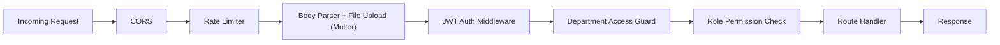

| Middleware | Purpose |
|---|---|
| **CORS** | Restrict origins to the PWA domain |
| **Rate Limiter** | Prevent abuse (e.g., 100 req/min per IP, stricter on auth routes) |
| **JWT Auth** | Verify access token, attach `req.user` with `{ id, role }` |
| **Department Access Guard** | For `/departments/:slug/*` routes — verify `DepartmentMember` exists and is `APPROVED` |
| **Role Permission Check** | Route-specific — e.g., only `TUTOR` can POST to `/resources` |

---

## 5. Security Architecture

### 5.1 Authentication Flow

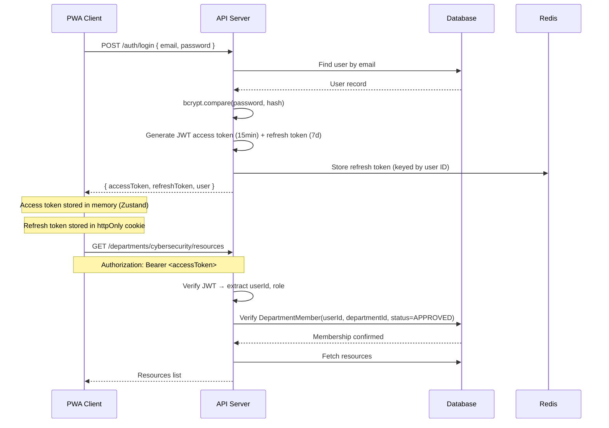

### 5.2 Security Measures

| Measure | Implementation |
|---|---|
| **Password Hashing** | bcrypt with cost factor 12 |
| **JWT Access Tokens** | Short-lived (15 min), stored in memory only |
| **Refresh Tokens** | Long-lived (7 days), httpOnly + Secure + SameSite cookie, stored in Redis for revocation |
| **Department Isolation** | Server-side middleware checks `DepartmentMember` table on every request. No client-side trust. |
| **Input Validation** | Zod schemas on all request bodies and params |
| **File Upload Security** | MIME type validation, file size limits (50MB default), virus scanning (ClamAV optional), sanitized filenames |
| **SQL Injection** | Prisma ORM parameterized queries (built-in protection) |
| **XSS Protection** | Content Security Policy headers, sanitized user-generated content (DOMPurify) |
| **Rate Limiting** | express-rate-limit: 100 req/min general, 5 req/min on auth endpoints |
| **HTTPS** | Enforced in production via reverse proxy (nginx) |

### 5.3 Department Isolation — Detailed

```
Cybersecurity Intern logs in
    → JWT contains { userId: "abc", role: "INTERN" }
    → Tries GET /departments/data-analysis/resources
    → departmentAccessGuard middleware:
        1. Resolves "data-analysis" slug → departmentId
        2. Queries DepartmentMember WHERE userId="abc" AND departmentId=... AND status="APPROVED"
        3. No record found → 403 Forbidden
    → Request blocked. Zero data leakage.
```

---

## 6. File Storage Architecture

### 6.1 Storage Strategy

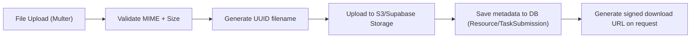

| Aspect | Design |
|---|---|
| **Storage Backend** | Supabase Storage (S3-compatible) — free tier sufficient for hackathon |
| **Bucket Structure** | `nexus-files/{departmentSlug}/resources/`, `nexus-files/{departmentSlug}/projects/{projectId}/submissions/`, `nexus-files/messages/attachments/` |
| **File Naming** | `{uuid}-{sanitized-original-name}` — prevents collisions and directory traversal |
| **Access Control** | Signed URLs with expiry (1 hour) — files are never publicly accessible |
| **Supported Types** | No restriction on file type (PDFs, videos, ZIPs, PSD, Blender files, etc.) |
| **Size Limits** | 50MB per file (configurable), 200MB total per upload batch |
| **Metadata Stored** | Original filename, MIME type, size in bytes, uploader ID, upload timestamp |

---

## 7. Real-Time & Push Notification Architecture

### 7.1 WebSocket (Socket.IO) — Department Chat

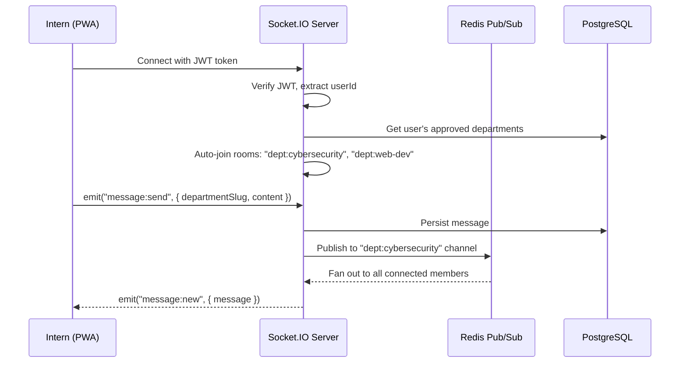

**Room Strategy:**
- Each department gets a Socket.IO room: `dept:{slug}`
- Users auto-join rooms for their approved departments on connect
- Messages are broadcast only to the department room
- Redis adapter enables horizontal scaling (multiple server instances)

### 7.2 Push Notifications (Web Push API)

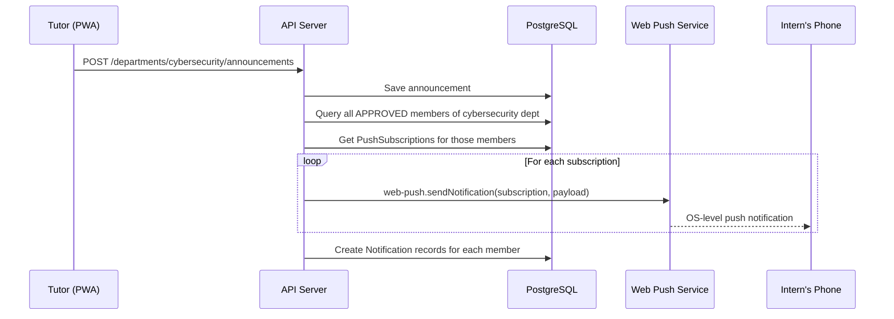

**Push Notification Triggers:**
| Event | Recipients | Payload |
|---|---|---|
| New Announcement | All dept members | `{ title, body, url: /dept/announcements/:id }` |
| Class Scheduled/Updated | All dept members | `{ title, body, url: /dept/schedule }` |
| Task Assigned | Assigned intern(s) | `{ title, body, url: /dept/projects/:pid/tasks/:tid }` |
| Submission Feedback | Submitting intern | `{ title, body, url: /dept/projects/:pid/tasks/:tid }` |
| New Message (if offline) | Dept members not connected via WS | `{ title, body, url: /dept/messages }` |

**PWA Service Worker** handles:
- Push event listener → show OS notification
- Notification click → open/focus the PWA at the relevant URL
- Background sync for offline message queuing

---

## 8. Frontend Architecture

### 8.1 Project Structure

```
nexus/
├── src/
│   ├── app/                          # Next.js App Router
│   │   ├── (auth)/                   # Auth layout group
│   │   │   ├── login/page.tsx
│   │   │   └── register/page.tsx
│   │   ├── (dashboard)/              # Authenticated layout group
│   │   │   ├── layout.tsx            # Sidebar + topbar + dept context
│   │   │   ├── page.tsx              # Dashboard home (dept overview)
│   │   │   ├── resources/page.tsx
│   │   │   ├── announcements/page.tsx
│   │   │   ├── schedule/page.tsx
│   │   │   ├── projects/
│   │   │   │   ├── page.tsx          # Projects list
│   │   │   │   └── [projectId]/
│   │   │   │       ├── page.tsx      # Kanban board / overview
│   │   │   │       └── tasks/[taskId]/page.tsx
│   │   │   ├── messages/page.tsx
│   │   │   └── settings/page.tsx
│   │   ├── admin/                    # Admin-only routes
│   │   │   ├── departments/page.tsx
│   │   │   └── users/page.tsx
│   │   ├── layout.tsx                # Root layout
│   │   └── globals.css
│   ├── components/
│   │   ├── ui/                       # Reusable primitives (Button, Modal, Card, etc.)
│   │   ├── resources/                # ResourceCard, ResourceUploadModal
│   │   ├── projects/                 # KanbanBoard, TaskCard, SubmissionForm
│   │   ├── messages/                 # ChatWindow, MessageBubble
│   │   ├── schedule/                 # CalendarView, ScheduleForm
│   │   └── layout/                   # Sidebar, Topbar, DepartmentSwitcher
│   ├── stores/                       # Zustand stores
│   │   ├── authStore.ts              # User, tokens, login/logout
│   │   ├── departmentStore.ts        # Active department context
│   │   ├── notificationStore.ts      # Unread count, notification list
│   │   └── socketStore.ts            # Socket.IO connection state
│   ├── hooks/                        # Custom React hooks
│   │   ├── useAuth.ts
│   │   ├── useDepartment.ts
│   │   ├── useSocket.ts
│   │   └── usePushNotifications.ts
│   ├── lib/
│   │   ├── api.ts                    # Axios instance with interceptors
│   │   ├── socket.ts                 # Socket.IO client setup
│   │   ├── push.ts                   # Push subscription helpers
│   │   └── utils.ts
│   ├── types/                        # Shared TypeScript interfaces
│   └── public/
│       ├── manifest.json             # PWA manifest
│       ├── sw.js                     # Service worker
│       └── icons/                    # PWA icons
├── server/
│   ├── src/
│   │   ├── index.ts                  # Express + Socket.IO bootstrap
│   │   ├── config/
│   │   │   ├── database.ts           # Prisma client
│   │   │   ├── redis.ts
│   │   │   └── storage.ts            # S3/Supabase client
│   │   ├── middleware/
│   │   │   ├── auth.ts               # JWT verification
│   │   │   ├── departmentGuard.ts    # Department membership check
│   │   │   ├── roleGuard.ts          # Role-based permission check
│   │   │   ├── rateLimiter.ts
│   │   │   └── upload.ts             # Multer config
│   │   ├── routes/
│   │   │   ├── auth.routes.ts
│   │   │   ├── department.routes.ts
│   │   │   ├── resource.routes.ts
│   │   │   ├── announcement.routes.ts
│   │   │   ├── schedule.routes.ts
│   │   │   ├── project.routes.ts
│   │   │   ├── message.routes.ts
│   │   │   └── notification.routes.ts
│   │   ├── controllers/              # Request handlers
│   │   ├── services/                 # Business logic
│   │   ├── validators/               # Zod schemas
│   │   ├── socket/                   # Socket.IO event handlers
│   │   │   └── chat.handler.ts
│   │   └── utils/
│   │       ├── pushNotification.ts   # Web Push helper
│   │       └── fileUpload.ts
│   └── prisma/
│       ├── schema.prisma             # Database schema
│       └── seed.ts                   # Seed departments + admin user
├── docker-compose.yml
├── Dockerfile.client
├── Dockerfile.server
├── package.json
└── .env.example
```

### 8.2 State Management Strategy

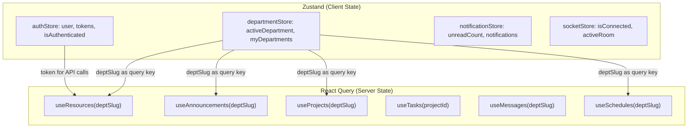

**Why this split?**
- **Zustand** for true client state (who's logged in, which department is active, socket connection status) — lightweight, no boilerplate.
- **React Query** for server-state (resources, projects, messages) — automatic caching, background refetching, optimistic updates, pagination. When the active department changes in Zustand, all React Query hooks automatically refetch with the new department slug.

### 8.3 Department Context Flow

When a user logs in:
1. `authStore` saves user + tokens
2. API call to `/auth/me` returns `myDepartments[]`
3. `departmentStore` sets the first approved department as `activeDepartment`
4. All dashboard components read from `departmentStore.activeDepartment`
5. The dashboard layout, sidebar, and all data queries are scoped to that department
6. The user sees only their department's interface — colors, resources, projects, messages

> [!NOTE]
> If a user belongs to multiple departments (unlikely for interns, possible for tutors), a department switcher in the sidebar allows switching context. All queries invalidate and refetch on switch.

---

## 9. PWA Configuration

### 9.1 manifest.json

```json
{
  "name": "Nexus — Tech Hub Platform",
  "short_name": "Nexus",
  "description": "Centralized resource sharing and project management",
  "start_url": "/",
  "display": "standalone",
  "background_color": "#0a0a0f",
  "theme_color": "#6366f1",
  "icons": [
    { "src": "/icons/icon-192.png", "sizes": "192x192", "type": "image/png" },
    { "src": "/icons/icon-512.png", "sizes": "512x512", "type": "image/png" }
  ]
}
```

### 9.2 Service Worker Responsibilities

| Capability | Strategy |
|---|---|
| **Static Asset Caching** | Cache-first for CSS, JS, fonts, icons |
| **API Response Caching** | Network-first with stale-while-revalidate for read endpoints |
| **Push Event** | Listen for push, display OS notification with action URL |
| **Notification Click** | Open or focus the PWA, navigate to the action URL |
| **Background Sync** | Queue failed message sends, retry when online |

---

## 10. Project Progress Tracking — Detailed

### 10.1 Kanban Board Model

Each project has tasks organized into four columns:

```
┌──────────┐  ┌──────────────┐  ┌───────────┐  ┌──────────┐
│   TODO   │  │ IN PROGRESS  │  │ IN REVIEW │  │   DONE   │
│          │  │              │  │           │  │          │
│ ┌──────┐ │  │ ┌──────────┐ │  │ ┌───────┐ │  │ ┌──────┐ │
│ │Task 1│ │  │ │ Task 3   │ │  │ │Task 5 │ │  │ │Task 2│ │
│ └──────┘ │  │ │ 🟡 Medium│ │  │ │Awaits │ │  │ │ ✅   │ │
│ ┌──────┐ │  │ │ @Alice   │ │  │ │review │ │  │ └──────┘ │
│ │Task 4│ │  │ └──────────┘ │  │ └───────┘ │  │ ┌──────┐ │
│ └──────┘ │  │              │  │           │  │ │Task 6│ │
│          │  │              │  │           │  │ │ ✅   │ │
│          │  │              │  │           │  │ └──────┘ │
└──────────┘  └──────────────┘  └───────────┘  └──────────┘
```

### 10.2 Progress Calculation

```
Project Progress = (Tasks with status DONE / Total Tasks) × 100%

Per-group breakdown also available:
  Group A: 3/5 tasks done = 60%
  Group B: 1/4 tasks done = 25%
  Overall: 4/9 tasks done = 44%
```

### 10.3 Task Lifecycle

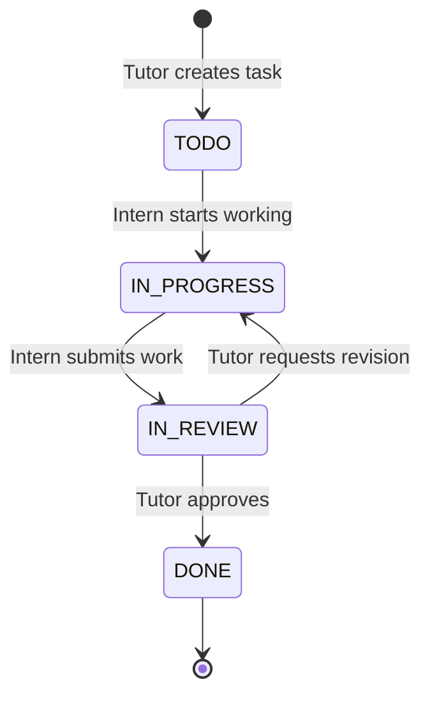

---

## 11. Deployment Architecture (Hackathon)

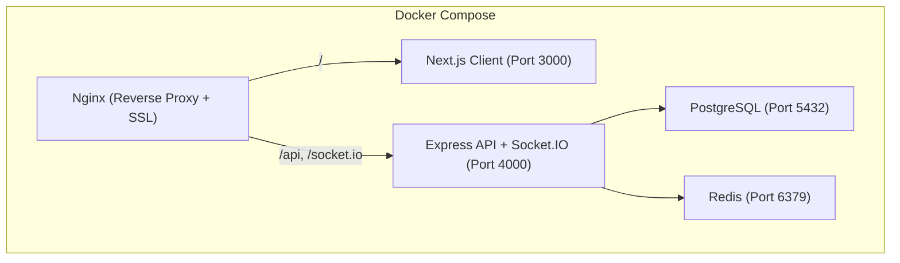

**docker-compose.yml services:**
- `nginx` — reverse proxy, SSL termination, static file serving
- `client` — Next.js production build
- `server` — Express API + Socket.IO
- `postgres` — PostgreSQL 16
- `redis` — Redis 7

> [!TIP]
> For the hackathon, deploy on a single VPS (e.g., DigitalOcean Droplet, Railway, or Render). The docker-compose setup makes it one-command deployable.

---

## User Review Required

> [!IMPORTANT]
> **Tech Stack Confirmation**: The plan uses **Next.js + Express + PostgreSQL + Redis**. This is a full-stack JavaScript/TypeScript setup. If your team has a preference for a different backend language (Python/Django, Go, etc.), let me know before I begin coding.

> [!IMPORTANT]
> **Scope for Hackathon**: This is a comprehensive architecture. For the hackathon, I recommend implementing in phases:
> - **Phase 1 (MVP)**: Auth, Departments, Resources, Announcements, Dashboard
> - **Phase 2**: Projects, Tasks, Kanban Board, Submissions
> - **Phase 3**: Real-time Messaging, Push Notifications, Class Scheduling
>
> Should I prioritize differently?

## Open Questions

> [!WARNING]
> 1. **Hosting/Deployment**: Do you have a hosting provider in mind, or should I optimize for free-tier options (Render, Railway, Supabase)?
> 2. **File Storage**: Are you okay with Supabase Storage (free tier: 1GB), or do you have AWS/GCP credits?
> 3. **Team Size**: How many developers are on your hackathon team? This affects how I structure the codebase for parallel work.
> 4. **Hackathon Timeline**: How long is the hackathon? This determines how much we can realistically build.
> 5. **Existing Accounts**: Do you already have accounts set up for any services (Supabase, Vercel, MongoDB Atlas, etc.)?

## Verification Plan

### Automated Tests
- Unit tests for middleware (auth, department guard, role guard)
- Integration tests for critical API flows (register → login → join department → access resources)
- Database seed script to populate test departments and users

### Manual Verification
- Register as intern, login, verify department isolation
- Upload a resource as tutor, verify intern can download
- Create project with tasks, verify kanban board updates
- Send a message, verify real-time delivery via WebSocket
- Trigger an announcement, verify push notification on a separate device
