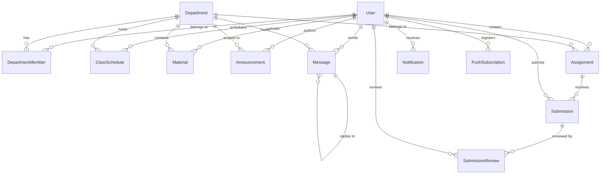
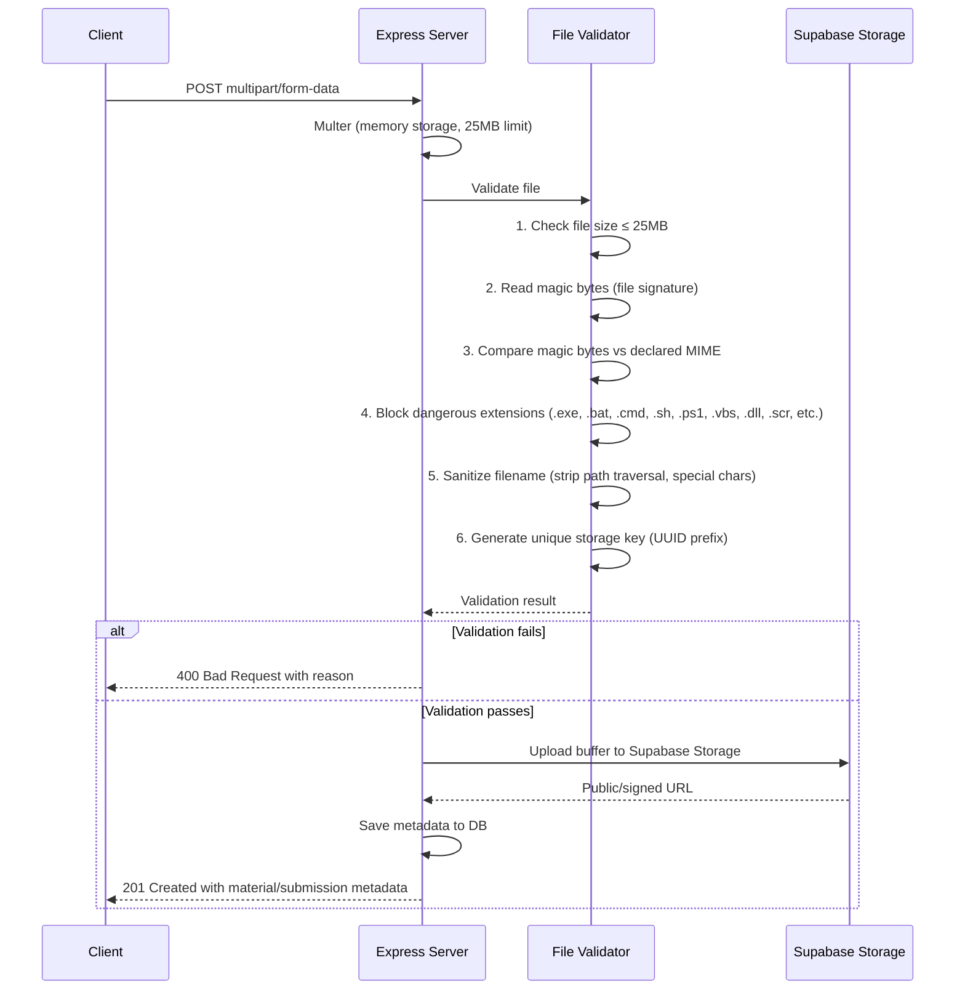
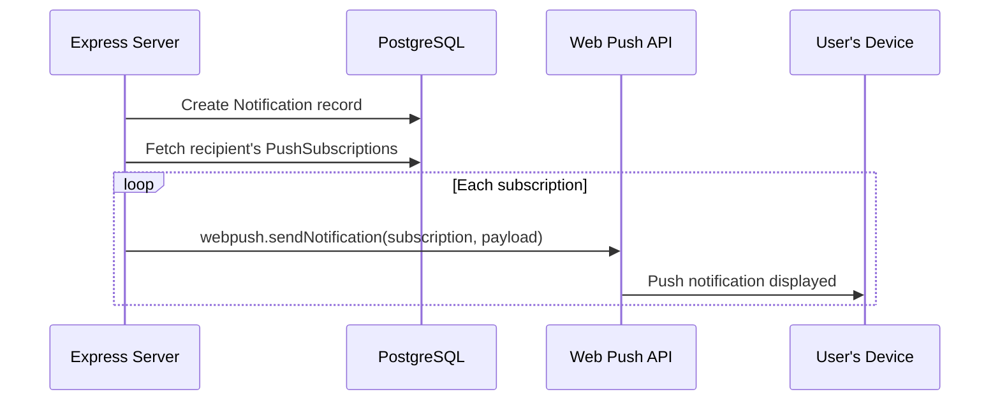
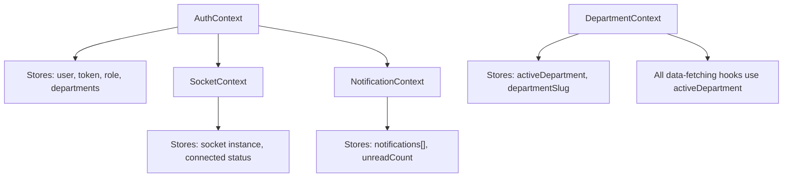
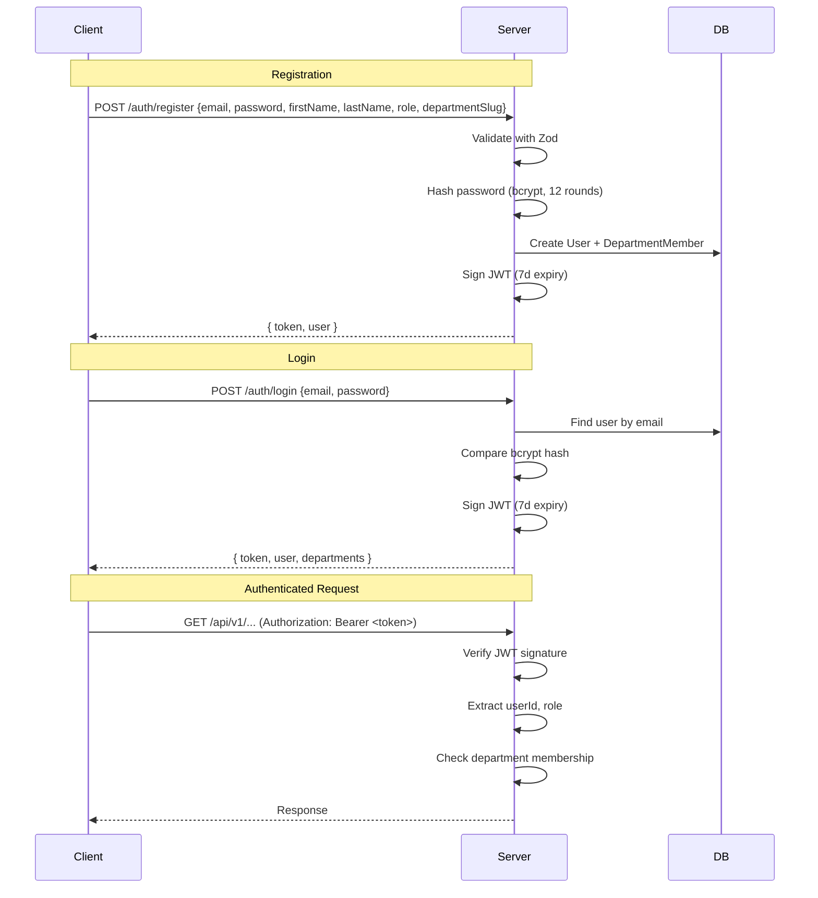
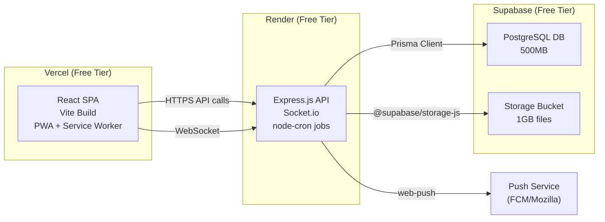
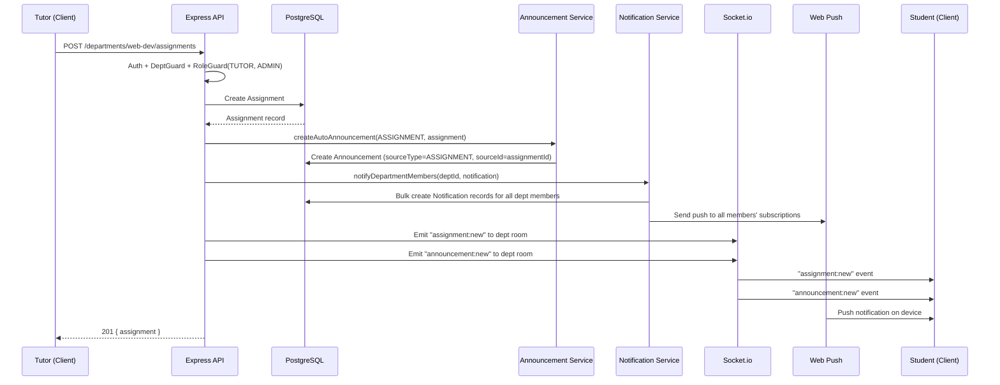
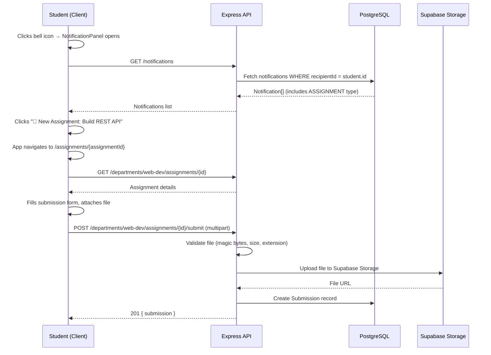

# Knowvia — Complete Platform Architecture

> **Knowvia** = Knowledge + Via (pathway) — A streamlined knowledge repository and learning management platform, rebuilt from the ground up as a responsive Progressive Web Application.

---

## 1. Executive Summary

Knowvia replaces the Nexus platform with a focused, four-feature experience: **Class Scheduling**, **Learning Materials** (file sharing), **Chatbox**, and **Announcements** — plus **Assignment Management** (replacing the old Project Management). The entire platform is architected to deploy **completely free** on free-tier services, with a clean, light-themed UI.

### What's Removed from Nexus
- Project management (groups, complex task boards) → replaced by simpler **Assignment Management**
- Members view (unnecessary overhead)
- Resource categories/pinning complexity
- Canvas confetti and decorative dependencies
- Complex modal system

### What's New / Changed
- Announcements are **auto-generated** when tutors create assignments, schedule classes, or upload materials
- Announcements are **clickable** — they deep-link to the relevant content
- **Assignment progress tracker** on student dashboards
- **Reminder notifications** sent 1 day before scheduled classes
- Bell icon notification center for students (not a full tab)
- Clean, light theme with soft minimal colors

---

## 2. Technology Stack & Free-Tier Deployment

### Frontend
| Concern | Choice | Rationale |
|---------|--------|-----------|
| Framework | **Vite + React 19 + TypeScript** | Already in use, fast builds, excellent DX |
| Styling | **Vanilla CSS** with CSS custom properties | Zero bundle cost, full control, light theme system |
| Icons | **Lucide React** | Already in use, tree-shakeable, lightweight |
| Real-time | **Socket.io Client** | Already in use, reliable WebSocket with fallbacks |
| PWA | **Vite PWA Plugin** (`vite-plugin-pwa`) | Service worker generation, offline caching, installability |
| Routing | **React Router v7** | Client-side routing for SPA |
| State | **React Context + useReducer** | No external state library needed for this scope |
| Hosting | **Vercel** (free tier) | 100GB bandwidth/mo, automatic HTTPS, global CDN |

### Backend
| Concern | Choice | Rationale |
|---------|--------|-----------|
| Runtime | **Express.js + TypeScript** | Already in use, mature ecosystem |
| ORM | **Prisma** | Already in use, type-safe, excellent migrations |
| Validation | **Zod** | Already in use, runtime type validation |
| Auth | **JWT** (access + refresh tokens) | Already in use, stateless, no session store needed |
| Password | **bcryptjs** | Already in use, pure JS implementation |
| File Upload | **Multer** (memory storage) → Supabase Storage | Stream to cloud, never persist locally |
| Push | **web-push** | Already in use, VAPID-based, completely free |
| Real-time | **Socket.io** | Already in use, department rooms |
| Scheduling | **node-cron** | Lightweight, runs in-process for reminder jobs |
| Hosting | **Render** (free tier) | 750 free hours/mo, auto-deploy from Git |

### Database & Storage
| Concern | Choice | Rationale |
|---------|--------|-----------|
| Database | **Supabase PostgreSQL** (free tier) | 500MB storage, 2 free projects, managed Postgres |
| File Storage | **Supabase Storage** (free tier) | 1GB storage, 2GB bandwidth/mo, S3-compatible |
| Dev Database | **SQLite** (local only) | Fast local dev, Prisma handles the abstraction |

> [!IMPORTANT]
> **Free-Tier Limits to Be Aware Of**
> - **Render free tier**: Server spins down after 15 min inactivity (first request after sleep takes ~30s). Acceptable for MVP.
> - **Supabase free tier**: 500MB database, 1GB file storage, 2GB egress/month. We enforce file size limits (25MB/file) to stay within bounds.
> - **Vercel free tier**: 100GB bandwidth, 6000 build minutes/month. More than enough.

---

## 3. User Roles & Permissions Matrix

Three roles: **ADMIN**, **TUTOR**, **INTERN** (student)

| Feature | ADMIN | TUTOR | INTERN |
|---------|-------|-------|--------|
| **Class Scheduling** — Create/Edit/Delete | ✅ All depts | ✅ Own dept only | ❌ |
| **Class Scheduling** — View | ✅ All depts | ✅ Own dept | ✅ Own dept |
| **Learning Materials** — Upload/Delete | ✅ All depts | ✅ Own dept only | ❌ |
| **Learning Materials** — View/Download | ✅ All depts | ✅ Own dept | ✅ Own dept |
| **Chatbox** — Send/Receive | ✅ All depts | ✅ Own dept | ✅ Own dept |
| **Chatbox** — Reply to message | ✅ | ✅ | ✅ |
| **Announcements** — Create manually | ✅ All depts (global) | ✅ Own dept only | ❌ |
| **Announcements** — View | ✅ Full tab | ✅ Full tab | 🔔 Bell icon only |
| **Assignments** — Create/Edit/Delete | ✅ All depts | ✅ Own dept only | ❌ |
| **Assignments** — View details | ✅ | ✅ | ✅ Own dept |
| **Assignments** — Submit work | ❌ | ❌ | ✅ |
| **Assignments** — Review submissions | ✅ | ✅ Own dept | ❌ |
| **Department Access** | All departments | Assigned dept(s) | Assigned dept only |
| **User Management** | ✅ | ❌ | ❌ |

> [!NOTE]
> **Admin announcement scope**: When an admin creates an announcement, it reflects across **all** departments. When a tutor creates one, it only reflects within their assigned department.

---

## 4. Database Schema (Prisma)

The schema is redesigned from the Nexus schema — simpler, with assignment-focused models replacing the project/group/task hierarchy.

```prisma
datasource db {
  provider = "postgresql"      // Supabase PostgreSQL in production
  url      = env("DATABASE_URL")
}

generator client {
  provider = "prisma-client-js"
}

// ─── USERS & DEPARTMENTS ───────────────────────────

model User {
  id           String   @id @default(uuid())
  email        String   @unique
  passwordHash String
  firstName    String
  lastName     String
  avatarUrl    String?
  role         Role     @default(INTERN)
  isActive     Boolean  @default(true)
  createdAt    DateTime @default(now())
  updatedAt    DateTime @updatedAt

  departmentMemberships DepartmentMember[]
  uploadedMaterials     Material[]
  announcements         Announcement[]
  scheduledClasses      ClassSchedule[]
  createdAssignments    Assignment[]
  submissions           Submission[]
  submissionReviews     SubmissionReview[]
  sentMessages          Message[]
  pushSubscriptions     PushSubscription[]
  notifications         Notification[]
}

enum Role {
  ADMIN
  TUTOR
  INTERN
}

model Department {
  id          String   @id @default(uuid())
  name        String   @unique
  slug        String   @unique
  description String
  icon        String   @default("book-open")
  colorHex    String   @default("#6366f1")
  isActive    Boolean  @default(true)
  createdAt   DateTime @default(now())

  members       DepartmentMember[]
  materials     Material[]
  announcements Announcement[]
  schedules     ClassSchedule[]
  assignments   Assignment[]
  messages      Message[]
  notifications Notification[]
}

model DepartmentMember {
  id           String       @id @default(uuid())
  userId       String
  departmentId String
  memberRole   MemberRole   @default(INTERN)
  status       MemberStatus @default(APPROVED)
  joinedAt     DateTime     @default(now())

  user       User       @relation(fields: [userId], references: [id], onDelete: Cascade)
  department Department @relation(fields: [departmentId], references: [id], onDelete: Cascade)

  @@unique([userId, departmentId])
}

enum MemberRole {
  TUTOR
  INTERN
}

enum MemberStatus {
  PENDING
  APPROVED
  REJECTED
}

// ─── CLASS SCHEDULING ──────────────────────────────

model ClassSchedule {
  id            String   @id @default(uuid())
  departmentId  String
  scheduledById String
  title         String
  description   String   @default("")
  startTime     DateTime
  endTime       DateTime
  location      String   @default("Hub Room A")
  meetingLink   String?
  reminderSent  Boolean  @default(false)  // tracks if 1-day reminder was sent
  createdAt     DateTime @default(now())
  updatedAt     DateTime @updatedAt

  department Department @relation(fields: [departmentId], references: [id], onDelete: Cascade)
  scheduler  User       @relation(fields: [scheduledById], references: [id], onDelete: Cascade)
}

// ─── LEARNING MATERIALS (File Sharing) ─────────────

model Material {
  id            String   @id @default(uuid())
  departmentId  String
  uploadedById  String
  title         String
  description   String   @default("")
  fileName      String           // original filename
  fileUrl       String           // Supabase Storage URL
  fileMimeType  String
  fileSizeBytes Int
  createdAt     DateTime @default(now())

  department Department @relation(fields: [departmentId], references: [id], onDelete: Cascade)
  uploader   User       @relation(fields: [uploadedById], references: [id], onDelete: Cascade)
}

// ─── ANNOUNCEMENTS ─────────────────────────────────

model Announcement {
  id           String            @id @default(uuid())
  departmentId String?           // null = global (admin-wide)
  authorId     String
  title        String
  content      String
  priority     AnnouncementPriority @default(NORMAL)
  // Deep-link metadata: what triggered this announcement
  sourceType   AnnouncementSource?  // ASSIGNMENT, CLASS_SCHEDULE, MATERIAL, or null (manual)
  sourceId     String?              // ID of the related entity
  createdAt    DateTime          @default(now())

  department Department? @relation(fields: [departmentId], references: [id], onDelete: Cascade)
  author     User        @relation(fields: [authorId], references: [id], onDelete: Cascade)
}

enum AnnouncementPriority {
  NORMAL
  IMPORTANT
  URGENT
}

enum AnnouncementSource {
  ASSIGNMENT
  CLASS_SCHEDULE
  MATERIAL
}

// ─── ASSIGNMENT MANAGEMENT ─────────────────────────

model Assignment {
  id           String           @id @default(uuid())
  departmentId String
  createdById  String
  title        String
  description  String
  status       AssignmentStatus @default(OPEN)
  dueDate      DateTime?
  maxFileSize  Int              @default(26214400) // 25MB default
  createdAt    DateTime         @default(now())
  updatedAt    DateTime         @updatedAt

  department  Department   @relation(fields: [departmentId], references: [id], onDelete: Cascade)
  creator     User         @relation(fields: [createdById], references: [id], onDelete: Cascade)
  submissions Submission[]
}

enum AssignmentStatus {
  OPEN
  CLOSED
  GRADED
}

model Submission {
  id            String   @id @default(uuid())
  assignmentId  String
  submittedById String
  notes         String   @default("")
  fileUrl       String?          // Supabase Storage URL
  fileName      String?
  fileSizeBytes Int?
  status        SubmissionStatus @default(SUBMITTED)
  submittedAt   DateTime @default(now())
  updatedAt     DateTime @updatedAt

  assignment Assignment         @relation(fields: [assignmentId], references: [id], onDelete: Cascade)
  submitter  User               @relation(fields: [submittedById], references: [id], onDelete: Cascade)
  reviews    SubmissionReview[]

  @@unique([assignmentId, submittedById]) // one submission per student per assignment
}

enum SubmissionStatus {
  SUBMITTED
  IN_REVIEW
  APPROVED
  NEEDS_REVISION
  REJECTED
}

model SubmissionReview {
  id           String   @id @default(uuid())
  submissionId String
  reviewerId   String
  comment      String
  verdict      ReviewVerdict @default(NEEDS_REVISION)
  createdAt    DateTime @default(now())

  submission Submission @relation(fields: [submissionId], references: [id], onDelete: Cascade)
  reviewer   User       @relation(fields: [reviewerId], references: [id], onDelete: Cascade)
}

enum ReviewVerdict {
  APPROVED
  NEEDS_REVISION
  REJECTED
}

// ─── CHAT ──────────────────────────────────────────

model Message {
  id           String   @id @default(uuid())
  departmentId String
  senderId     String
  content      String
  replyToId    String?           // reply threading
  createdAt    DateTime @default(now())

  department Department @relation(fields: [departmentId], references: [id], onDelete: Cascade)
  sender     User       @relation(fields: [senderId], references: [id], onDelete: Cascade)
  replyTo    Message?   @relation("MessageReplies", fields: [replyToId], references: [id])
  replies    Message[]  @relation("MessageReplies")
}

// ─── NOTIFICATIONS & PUSH ──────────────────────────

model Notification {
  id           String   @id @default(uuid())
  recipientId  String
  departmentId String?
  type         NotificationType
  title        String
  body         String
  actionUrl    String           // deep-link path within the app
  isRead       Boolean  @default(false)
  createdAt    DateTime @default(now())

  recipient  User        @relation(fields: [recipientId], references: [id], onDelete: Cascade)
  department Department? @relation(fields: [departmentId], references: [id], onDelete: SetNull)
}

enum NotificationType {
  ANNOUNCEMENT
  CLASS_SCHEDULE
  CLASS_REMINDER
  ASSIGNMENT_CREATED
  SUBMISSION_REVIEWED
  MATERIAL_UPLOADED
  MESSAGE
}

model PushSubscription {
  id        String   @id @default(uuid())
  userId    String
  endpoint  String   @unique
  p256dh    String
  auth      String
  userAgent String?
  createdAt DateTime @default(now())

  user User @relation(fields: [userId], references: [id], onDelete: Cascade)
}
```

### Entity Relationship Diagram



---

## 5. API Architecture

Base URL: `/api/v1`

### Authentication
| Method | Endpoint | Description | Auth |
|--------|----------|-------------|------|
| POST | `/auth/register` | Register new user | Public |
| POST | `/auth/login` | Login, returns JWT + user | Public |
| GET | `/auth/me` | Get current user profile | JWT |
| POST | `/auth/refresh` | Refresh access token | Refresh token |

### Class Schedules
| Method | Endpoint | Description | Auth |
|--------|----------|-------------|------|
| GET | `/departments/:slug/schedules` | List schedules for department | JWT + Dept member |
| POST | `/departments/:slug/schedules` | Create a class schedule | JWT + TUTOR/ADMIN |
| PUT | `/departments/:slug/schedules/:id` | Update a schedule | JWT + Creator/ADMIN |
| DELETE | `/departments/:slug/schedules/:id` | Delete a schedule | JWT + Creator/ADMIN |

### Learning Materials
| Method | Endpoint | Description | Auth |
|--------|----------|-------------|------|
| GET | `/departments/:slug/materials` | List materials | JWT + Dept member |
| POST | `/departments/:slug/materials` | Upload a material (multipart) | JWT + TUTOR/ADMIN |
| GET | `/departments/:slug/materials/:id/download` | Get signed download URL | JWT + Dept member |
| DELETE | `/departments/:slug/materials/:id` | Delete a material | JWT + Uploader/ADMIN |

### Announcements
| Method | Endpoint | Description | Auth |
|--------|----------|-------------|------|
| GET | `/departments/:slug/announcements` | List dept announcements | JWT + Dept member |
| GET | `/announcements/global` | List global announcements | JWT |
| POST | `/departments/:slug/announcements` | Create announcement | JWT + TUTOR/ADMIN |
| POST | `/announcements/global` | Create global announcement | JWT + ADMIN |

### Assignments
| Method | Endpoint | Description | Auth |
|--------|----------|-------------|------|
| GET | `/departments/:slug/assignments` | List assignments | JWT + Dept member |
| POST | `/departments/:slug/assignments` | Create assignment | JWT + TUTOR/ADMIN |
| GET | `/departments/:slug/assignments/:id` | Get assignment details + submissions | JWT + Dept member |
| PUT | `/departments/:slug/assignments/:id` | Update assignment | JWT + Creator/ADMIN |
| DELETE | `/departments/:slug/assignments/:id` | Delete assignment | JWT + Creator/ADMIN |
| POST | `/departments/:slug/assignments/:id/submit` | Submit work (multipart) | JWT + INTERN |
| PUT | `/departments/:slug/assignments/:id/submissions/:subId/review` | Review a submission | JWT + TUTOR/ADMIN |

### Chat Messages
| Method | Endpoint | Description | Auth |
|--------|----------|-------------|------|
| GET | `/departments/:slug/messages` | Get message history (paginated) | JWT + Dept member |

> Real-time messaging is handled via Socket.io, not REST. The GET endpoint is for loading history on page load.

### Notifications
| Method | Endpoint | Description | Auth |
|--------|----------|-------------|------|
| GET | `/notifications` | Get user's notifications (paginated) | JWT |
| PUT | `/notifications/:id/read` | Mark notification as read | JWT |
| PUT | `/notifications/read-all` | Mark all as read | JWT |
| POST | `/push/subscribe` | Register push subscription | JWT |
| DELETE | `/push/unsubscribe` | Remove push subscription | JWT |

### Departments (Admin)
| Method | Endpoint | Description | Auth |
|--------|----------|-------------|------|
| GET | `/departments` | List all departments | JWT |
| GET | `/departments/:slug` | Get department details | JWT + Dept member |

---

## 6. Real-Time Architecture (Socket.io)

### Room Strategy
```
user:{userId}          → Personal notifications
dept:{departmentSlug}  → Department-scoped events (chat, announcements, schedules)
global                 → Admin-wide announcements
```

### Events
| Event | Direction | Payload | Description |
|-------|-----------|---------|-------------|
| `message:send` | Client → Server | `{ departmentSlug, content, replyToId? }` | Send chat message |
| `message:new` | Server → Client | Full message object with sender | New message broadcast to dept room |
| `announcement:new` | Server → Client | Announcement object | New announcement (dept or global room) |
| `schedule:new` | Server → Client | ClassSchedule object | New class scheduled |
| `schedule:updated` | Server → Client | ClassSchedule object | Schedule modified |
| `assignment:new` | Server → Client | Assignment object | New assignment created |
| `material:new` | Server → Client | Material metadata | New material uploaded |
| `notification:new` | Server → Client | Notification object | Personal notification pushed |
| `typing:start` | Client → Server | `{ departmentSlug }` | User started typing |
| `typing:stop` | Client → Server | `{ departmentSlug }` | User stopped typing |
| `user:typing` | Server → Client | `{ userId, name, departmentSlug }` | Typing indicator broadcast |

---

## 7. File Security & Upload Strategy

> [!CAUTION]
> File security is critical. Since we accept **any file type**, we must validate rigorously server-side.

### Upload Flow


### Security Measures
1. **Magic byte validation**: Read first bytes of file to verify actual type matches declared MIME type (prevents `.exe` renamed to `.pdf`)
2. **Extension blocklist**: Block executable extensions: `.exe`, `.bat`, `.cmd`, `.sh`, `.ps1`, `.vbs`, `.dll`, `.scr`, `.msi`, `.com`, `.pif`, `.hta`, `.cpl`, `.inf`, `.reg`, `.ws`, `.wsf`, `.jar`
3. **File size enforcement**: Hard limit at **25MB per file** (configurable via env). Multer rejects before buffering completes.
4. **Filename sanitization**: Strip path traversal (`../`), null bytes, and special characters. Prefix with UUID.
5. **Storage isolation**: Files stored in Supabase Storage with **signed URLs** (time-limited access, not public). Only authenticated, department-authorized users can generate download URLs.
6. **Content-Disposition**: Force `attachment` disposition on downloads to prevent browser execution of uploaded HTML/SVG/JS files.
7. **CORS on Storage**: Supabase bucket configured to only accept requests from our domain.
8. **Rate limiting**: Limit upload requests to prevent storage abuse (e.g., 10 uploads/hour per user).

---

## 8. Announcement Auto-Generation & Deep Linking

### Auto-Generation Flow
When a tutor/admin performs any of these actions, an announcement is **automatically created**:

| Action | Announcement Title Pattern | Deep Link |
|--------|---------------------------|-----------|
| Create Assignment | "📝 New Assignment: {title}" | `/assignments/{id}` |
| Schedule Class | "📅 Class Scheduled: {title} on {date}" | `/schedule` (highlighted) |
| Upload Material | "📚 New Material: {title}" | `/materials/{id}` |

### Deep Link Behavior
- Each announcement stores `sourceType` (ASSIGNMENT, CLASS_SCHEDULE, MATERIAL) and `sourceId`
- When a student clicks an announcement in the bell notification panel, the app navigates to the appropriate view:
  - `ASSIGNMENT` → Opens Assignment Management page, scrolls to/highlights that assignment
  - `CLASS_SCHEDULE` → Opens Schedule view, highlights the relevant class
  - `MATERIAL` → Opens Learning Materials view, highlights the file

---

## 9. Push Notifications & Class Reminders

### Push Notification Flow


### Class Reminder System
A **node-cron** job runs every hour on the server:

```
Schedule: "0 * * * *" (every hour, on the hour)
```

1. Query all `ClassSchedule` records where:
   - `startTime` is within the next 24 hours AND
   - `reminderSent` is `false`
2. For each matching schedule:
   - Fetch all department members (INTERN + TUTOR)
   - Create `Notification` records with type `CLASS_REMINDER`
   - Send push notifications to all members' subscriptions
   - Set `reminderSent = true`

> [!NOTE]
> Since Render free tier may spin down the server, the cron job runs on server startup AND hourly. If the server sleeps and wakes up, it immediately checks for any missed reminders.

---

## 10. Frontend Architecture

### Page / Route Structure

```
/                          → Redirect to /login or /dashboard
/login                     → Login page
/register                  → Registration page
/dashboard                 → Role-based dashboard (main view)
/schedule                  → Class schedule view
/materials                 → Learning Materials (tutors: upload + list, students: list only)
/chat                      → Department chatbox
/assignments               → Assignment management
/assignments/:id           → Assignment detail + submission
/announcements             → Announcements tab (tutors/admin only route)
```

### Component Hierarchy

```
App
├── AuthProvider (Context: user, token, login, logout, register)
├── SocketProvider (Context: socket instance, connection state)
├── NotificationProvider (Context: notifications, unread count, mark read)
│
├── PublicRoutes
│   ├── LoginPage
│   └── RegisterPage
│
└── ProtectedRoutes (requires auth)
    ├── AppLayout
    │   ├── Sidebar (navigation, department selector)
    │   ├── TopBar
    │   │   ├── Search (future)
    │   │   ├── NotificationBell (students: opens dropdown panel)
    │   │   └── UserMenu (profile, logout)
    │   │
    │   └── MainContent (route-based)
    │       ├── DashboardPage
    │       │   ├── [TUTOR/ADMIN] ScheduleWidget (primary, large)
    │       │   ├── [TUTOR/ADMIN] RecentMaterialsWidget
    │       │   ├── [TUTOR/ADMIN] AssignmentOverviewWidget
    │       │   ├── [INTERN] UpcomingClassesWidget (primary, large)
    │       │   ├── [INTERN] AssignmentProgressTracker
    │       │   │   ├── Progress meter / summary chart
    │       │   │   ├── Primary assignment view
    │       │   │   └── Recent status updates
    │       │   └── [INTERN] RecentAnnouncementsWidget
    │       │
    │       ├── SchedulePage
    │       │   ├── CalendarView / ListView toggle
    │       │   ├── ScheduleCard (per class)
    │       │   └── [TUTOR/ADMIN] CreateScheduleForm
    │       │
    │       ├── MaterialsPage
    │       │   ├── MaterialsList (filterable, searchable)
    │       │   ├── MaterialCard (title, type icon, size, download)
    │       │   └── [TUTOR/ADMIN] UploadMaterialForm
    │       │
    │       ├── ChatPage
    │       │   ├── MessageList (scrollable, auto-scroll)
    │       │   ├── MessageBubble (sender name, timestamp, reply indicator)
    │       │   ├── ReplyPreview (when replying to a specific message)
    │       │   └── MessageInput (text only, no emojis)
    │       │
    │       ├── AssignmentsPage
    │       │   ├── AssignmentsList
    │       │   ├── AssignmentCard (title, due date, status, submission count)
    │       │   └── [TUTOR/ADMIN] CreateAssignmentForm
    │       │
    │       ├── AssignmentDetailPage
    │       │   ├── AssignmentInfo (description, due date, creator)
    │       │   ├── [INTERN] SubmissionForm (file upload + notes)
    │       │   ├── [INTERN] MySubmissionStatus
    │       │   └── [TUTOR/ADMIN] SubmissionsList + ReviewForm
    │       │
    │       └── AnnouncementsPage (TUTOR/ADMIN only)
    │           ├── AnnouncementsList (all, including auto-generated)
    │           └── CreateAnnouncementForm
    │
    └── NotificationPanel (overlay/dropdown for INTERN bell icon)
        ├── NotificationItem (clickable, deep-links to source)
        └── MarkAllReadButton
```

### State Management



| Context | Purpose | Persisted? |
|---------|---------|------------|
| `AuthContext` | User session, JWT, role, departments | `localStorage` (token + user) |
| `SocketContext` | Socket.io connection lifecycle | Memory only |
| `NotificationContext` | In-app notifications, unread count | Memory (fetched on load) |
| `DepartmentContext` | Currently selected department | `localStorage` |

### Data Fetching Pattern
- **Custom hooks** (`useSchedules`, `useMaterials`, `useAssignments`, `useMessages`, `useAnnouncements`) encapsulate API calls
- Hooks use `useEffect` + `useState` for initial fetch
- Socket events update state in real-time (new items prepended/appended)
- Paginated endpoints use cursor-based pagination for chat history

---

## 11. UI Design System

### Theme — Clean, Light, Minimal

```css
:root {
  /* Base palette — soft, warm neutrals */
  --color-bg-primary: #FAFBFC;
  --color-bg-secondary: #FFFFFF;
  --color-bg-tertiary: #F3F4F6;
  --color-bg-hover: #E5E7EB;
  
  /* Text */
  --color-text-primary: #1F2937;
  --color-text-secondary: #6B7280;
  --color-text-tertiary: #9CA3AF;
  --color-text-inverse: #FFFFFF;
  
  /* Accent — soft indigo/blue */
  --color-accent: #6366F1;
  --color-accent-hover: #4F46E5;
  --color-accent-light: #EEF2FF;
  --color-accent-subtle: #C7D2FE;
  
  /* Status colors — muted, not harsh */
  --color-success: #10B981;
  --color-success-light: #D1FAE5;
  --color-warning: #F59E0B;
  --color-warning-light: #FEF3C7;
  --color-error: #EF4444;
  --color-error-light: #FEE2E2;
  --color-info: #3B82F6;
  --color-info-light: #DBEAFE;
  
  /* Spacing scale */
  --space-xs: 4px;
  --space-sm: 8px;
  --space-md: 16px;
  --space-lg: 24px;
  --space-xl: 32px;
  --space-2xl: 48px;
  
  /* Border radius */
  --radius-sm: 6px;
  --radius-md: 10px;
  --radius-lg: 16px;
  --radius-full: 9999px;
  
  /* Shadows — very subtle */
  --shadow-sm: 0 1px 2px rgba(0, 0, 0, 0.04);
  --shadow-md: 0 2px 8px rgba(0, 0, 0, 0.06);
  --shadow-lg: 0 4px 16px rgba(0, 0, 0, 0.08);
  
  /* Typography */
  --font-family: 'Inter', -apple-system, BlinkMacSystemFont, 'Segoe UI', sans-serif;
  --font-size-xs: 0.75rem;
  --font-size-sm: 0.875rem;
  --font-size-base: 1rem;
  --font-size-lg: 1.125rem;
  --font-size-xl: 1.25rem;
  --font-size-2xl: 1.5rem;
  --font-size-3xl: 2rem;
  
  /* Transitions */
  --transition-fast: 150ms ease;
  --transition-normal: 250ms ease;
}
```

### Responsive Breakpoints
```css
/* Mobile first */
/* sm: 640px  — small tablets */
/* md: 768px  — tablets */
/* lg: 1024px — laptops */
/* xl: 1280px — desktops */
```

### Layout Strategy
- **Mobile (< 768px)**: Bottom navigation bar, full-width content, collapsible panels
- **Tablet (768px–1024px)**: Collapsible sidebar, responsive grid
- **Desktop (> 1024px)**: Fixed sidebar, multi-column dashboard widgets

---

## 12. Security Architecture

### Authentication Flow


### Middleware Chain
```
Request → cors → bodyParser → authMiddleware → departmentGuard → roleGuard → Controller
```

1. **`authMiddleware`**: Verifies JWT, attaches `req.user = { id, role }`
2. **`departmentGuard`**: For `/departments/:slug/*` routes — verifies user is an approved member of that department (or is ADMIN)
3. **`roleGuard(roles[])`**: Checks `req.user.role` is in the allowed roles list
4. **Rate limiting**: `express-rate-limit` on auth endpoints (5 attempts/15 min) and upload endpoints (10/hour)

### Additional Security Measures
- **Input validation**: All request bodies validated with Zod schemas before touching the database
- **SQL injection prevention**: Prisma parameterized queries (default behavior)
- **XSS prevention**: React's built-in JSX escaping + CSP headers
- **CORS**: Strict origin allowlist (only our Vercel frontend domain)
- **Helmet.js**: Security headers (X-Content-Type-Options, X-Frame-Options, etc.)
- **JWT secret rotation**: Documented process for key rotation in production

---

## 13. Error Handling Strategy

### Backend
```typescript
// Standardized error response format
interface ApiError {
  error: string;        // Human-readable message
  code?: string;        // Machine-readable error code (e.g., "AUTH_INVALID_TOKEN")
  details?: unknown;    // Validation errors array (Zod)
}
```

- **Global error handler** middleware catches unhandled errors, logs them, returns 500
- **Zod validation errors** return 400 with field-level details
- **Auth errors** return 401/403 with clear messages
- **Not found** returns 404
- **Rate limit** returns 429

### Frontend
- **API service layer** wraps `fetch` with automatic token attachment, error parsing, and 401 → redirect to login
- **Toast notifications** for transient errors (network issues, validation failures)
- **Error boundaries** for component-level React crashes
- **Optimistic updates** for chat messages (show immediately, retry on failure)

---

## 14. Deployment Architecture



### Environment Variables

**Server (Render)**:
```env
NODE_ENV=production
PORT=4000
DATABASE_URL=postgresql://...@db.xxx.supabase.co:5432/postgres
JWT_SECRET=<generated-secure-key>
JWT_REFRESH_SECRET=<generated-secure-key>
CLIENT_URL=https://knowvia.vercel.app
SUPABASE_URL=https://xxx.supabase.co
SUPABASE_SERVICE_KEY=<supabase-service-role-key>
SUPABASE_STORAGE_BUCKET=knowvia-files
VAPID_PUBLIC_KEY=<generated>
VAPID_PRIVATE_KEY=<generated>
VAPID_SUBJECT=mailto:admin@knowvia.app
MAX_FILE_SIZE_MB=25
UPLOAD_RATE_LIMIT=10
```

**Client (Vercel)**:
```env
VITE_API_URL=https://knowvia-api.onrender.com
VITE_WS_URL=https://knowvia-api.onrender.com
VITE_VAPID_PUBLIC_KEY=<same-as-server>
```

### Build & Deploy Pipeline
1. **Git push** to `main` branch
2. **Vercel** auto-builds client: `cd client && npm run build`
3. **Render** auto-builds server: `cd server && npm run build && npm start`
4. **Prisma migrations** run as part of Render's build command: `npx prisma migrate deploy`

---

## 15. Project File Structure (New)

```
knowvia/
├── client/
│   ├── public/
│   │   ├── manifest.json            # PWA manifest
│   │   ├── sw.js                    # Service worker (generated by vite-plugin-pwa)
│   │   └── icons/                   # PWA icons (192x192, 512x512)
│   ├── src/
│   │   ├── main.tsx                 # Entry point
│   │   ├── App.tsx                  # Root component, router setup
│   │   ├── index.css                # Global styles, CSS custom properties
│   │   │
│   │   ├── contexts/
│   │   │   ├── AuthContext.tsx
│   │   │   ├── SocketContext.tsx
│   │   │   ├── NotificationContext.tsx
│   │   │   └── DepartmentContext.tsx
│   │   │
│   │   ├── hooks/
│   │   │   ├── useSchedules.ts
│   │   │   ├── useMaterials.ts
│   │   │   ├── useAssignments.ts
│   │   │   ├── useMessages.ts
│   │   │   ├── useAnnouncements.ts
│   │   │   └── useNotifications.ts
│   │   │
│   │   ├── services/
│   │   │   ├── api.ts               # Base fetch wrapper with auth
│   │   │   └── push.ts              # Push subscription helpers
│   │   │
│   │   ├── pages/
│   │   │   ├── LoginPage.tsx
│   │   │   ├── RegisterPage.tsx
│   │   │   ├── DashboardPage.tsx
│   │   │   ├── SchedulePage.tsx
│   │   │   ├── MaterialsPage.tsx
│   │   │   ├── ChatPage.tsx
│   │   │   ├── AssignmentsPage.tsx
│   │   │   ├── AssignmentDetailPage.tsx
│   │   │   └── AnnouncementsPage.tsx
│   │   │
│   │   ├── components/
│   │   │   ├── layout/
│   │   │   │   ├── AppLayout.tsx
│   │   │   │   ├── Sidebar.tsx
│   │   │   │   ├── TopBar.tsx
│   │   │   │   ├── BottomNav.tsx     # Mobile navigation
│   │   │   │   └── ProtectedRoute.tsx
│   │   │   │
│   │   │   ├── dashboard/
│   │   │   │   ├── UpcomingClassesWidget.tsx
│   │   │   │   ├── AssignmentProgressTracker.tsx
│   │   │   │   ├── RecentAnnouncementsWidget.tsx
│   │   │   │   ├── ScheduleWidget.tsx
│   │   │   │   └── QuickStatsWidget.tsx
│   │   │   │
│   │   │   ├── schedule/
│   │   │   │   ├── ScheduleCard.tsx
│   │   │   │   └── CreateScheduleForm.tsx
│   │   │   │
│   │   │   ├── materials/
│   │   │   │   ├── MaterialCard.tsx
│   │   │   │   └── UploadMaterialForm.tsx
│   │   │   │
│   │   │   ├── chat/
│   │   │   │   ├── MessageList.tsx
│   │   │   │   ├── MessageBubble.tsx
│   │   │   │   ├── ReplyPreview.tsx
│   │   │   │   └── MessageInput.tsx
│   │   │   │
│   │   │   ├── assignments/
│   │   │   │   ├── AssignmentCard.tsx
│   │   │   │   ├── CreateAssignmentForm.tsx
│   │   │   │   ├── SubmissionForm.tsx
│   │   │   │   └── SubmissionReviewCard.tsx
│   │   │   │
│   │   │   ├── notifications/
│   │   │   │   ├── NotificationBell.tsx
│   │   │   │   ├── NotificationPanel.tsx
│   │   │   │   └── NotificationItem.tsx
│   │   │   │
│   │   │   └── ui/
│   │   │       ├── Button.tsx
│   │   │       ├── Input.tsx
│   │   │       ├── Modal.tsx
│   │   │       ├── Toast.tsx
│   │   │       ├── FileUpload.tsx
│   │   │       ├── ProgressBar.tsx
│   │   │       ├── Badge.tsx
│   │   │       ├── Card.tsx
│   │   │       ├── EmptyState.tsx
│   │   │       └── LoadingSpinner.tsx
│   │   │
│   │   └── types/
│   │       └── index.ts             # All TypeScript interfaces
│   │
│   ├── index.html
│   ├── vite.config.ts
│   ├── tsconfig.json
│   └── package.json
│
├── server/
│   ├── prisma/
│   │   ├── schema.prisma
│   │   ├── migrations/              # Prisma migration files
│   │   └── seed.ts                  # Seed data (departments, admin user)
│   ├── src/
│   │   ├── index.ts                 # Express server entry
│   │   ├── config/
│   │   │   ├── prisma.ts            # Prisma client singleton
│   │   │   └── supabase.ts          # Supabase storage client
│   │   │
│   │   ├── middleware/
│   │   │   ├── auth.ts              # JWT verification
│   │   │   ├── departmentGuard.ts   # Department membership check
│   │   │   ├── roleGuard.ts         # Role-based access
│   │   │   ├── rateLimiter.ts       # Rate limiting
│   │   │   ├── upload.ts            # Multer config (memory storage)
│   │   │   └── fileValidator.ts     # Magic byte + extension validation
│   │   │
│   │   ├── controllers/
│   │   │   ├── auth.controller.ts
│   │   │   ├── schedule.controller.ts
│   │   │   ├── material.controller.ts
│   │   │   ├── announcement.controller.ts
│   │   │   ├── assignment.controller.ts
│   │   │   ├── message.controller.ts
│   │   │   └── notification.controller.ts
│   │   │
│   │   ├── routes/
│   │   │   ├── auth.routes.ts
│   │   │   ├── department.routes.ts
│   │   │   └── notification.routes.ts
│   │   │
│   │   ├── services/
│   │   │   ├── announcement.service.ts   # Auto-generation logic
│   │   │   ├── notification.service.ts   # Create + push notifications
│   │   │   └── reminder.service.ts       # Cron job for class reminders
│   │   │
│   │   ├── socket/
│   │   │   └── index.ts             # Socket.io setup + event handlers
│   │   │
│   │   └── utils/
│   │       ├── fileSignatures.ts    # Magic byte definitions
│   │       └── validation.ts        # Zod schemas
│   │
│   ├── tsconfig.json
│   └── package.json
│
├── .gitignore
├── package.json                     # Monorepo root scripts
└── README.md
```

---

## 16. Data Flow: End-to-End Examples

### Example 1: Tutor Creates an Assignment



### Example 2: Student Checks Bell → Clicks Announcement → Submits Assignment



---

## 17. Assignment Progress Tracker (Student Dashboard)

The student dashboard prominently displays an **Assignment Progress Tracker** widget:

### Data Aggregation
```sql
-- For a given student + department, calculate:
Total assignments in department:        COUNT(assignments)
Submitted assignments:                  COUNT(submissions WHERE submittedById = studentId)
Approved assignments:                   COUNT(submissions WHERE status = 'APPROVED')
Pending review:                         COUNT(submissions WHERE status IN ('SUBMITTED', 'IN_REVIEW'))
Needs revision:                         COUNT(submissions WHERE status = 'NEEDS_REVISION')
Not yet submitted:                      Total - Submitted
```

### Widget Components
1. **Progress Ring/Bar**: Visual percentage of `approved / total` assignments
2. **Summary Stats**: Cards showing submitted, approved, pending, needs-revision counts
3. **Primary Assignment**: The assignment the student is currently working on (most recently submitted or next due)
4. **Recent Status Updates**: List of latest submission review verdicts (e.g., "✅ Build REST API — Approved", "🔄 CSS Layout — Needs Revision")

---

## 18. Dependencies (New vs Existing)

### Server — New Dependencies
| Package | Purpose | Size Impact |
|---------|---------|-------------|
| `@supabase/supabase-js` | Storage client for file uploads | ~50KB |
| `node-cron` | Class reminder scheduler | ~10KB |
| `express-rate-limit` | Rate limiting on auth + uploads | ~15KB |
| `helmet` | Security headers | ~20KB |
| `file-type` | Magic byte detection for upload validation | ~30KB |

### Server — Removed Dependencies
| Package | Reason |
|---------|--------|
| (none removed, all existing deps still needed) | — |

### Client — New Dependencies
| Package | Purpose | Size Impact |
|---------|---------|-------------|
| `react-router-dom` | Client-side routing | ~30KB |
| `vite-plugin-pwa` | PWA generation (dev dependency) | Build-time only |

### Client — Removed Dependencies
| Package | Reason |
|---------|--------|
| `canvas-confetti` | Unnecessary decorative effect |
| `@types/canvas-confetti` | — |

---

## Open Questions

> [!IMPORTANT]
> **1. Department assignment during registration**: Should students/tutors select their department during registration (current behavior), or should an admin assign them after? The current flow auto-approves on registration, which is convenient but less controlled.

> [!IMPORTANT]  
> **2. Multiple department membership**: Can a tutor belong to multiple departments? The current schema supports it. Should we keep this flexibility, or enforce one department per tutor?

> [!IMPORTANT]
> **3. File storage budget**: With 1GB free Supabase storage and a 25MB per-file limit, that's roughly 40 files before hitting the cap. Should we:
> - (a) Keep 25MB limit and accept the constraint for MVP
> - (b) Lower to 10MB per file (~100 files capacity)
> - (c) Use a different free storage provider with more capacity (e.g., Cloudflare R2 has 10GB free)

> [!NOTE]
> **4. Chat attachments**: The old Nexus chat supported file attachments in messages. Since Knowvia has a dedicated Materials section, should chat remain **text-only** to keep it simple and conserve storage?

> [!NOTE]
> **5. Admin user creation**: Should the first admin be created via a seed script (as currently), or should there be a one-time setup flow?

---

## Verification Plan

### Automated Tests
- `npm run build` on both client and server to verify TypeScript compilation
- Prisma schema validation: `npx prisma validate`
- Prisma migration dry-run: `npx prisma migrate dev --create-only`

### Manual Verification
- **Auth flow**: Register → Login → JWT stored → Protected routes accessible
- **Department isolation**: Login as Intern in dept A → cannot see dept B data
- **File upload**: Upload a file → verify it appears in Supabase Storage → download works
- **File security**: Upload a renamed `.exe` → verify it's rejected by magic byte validation
- **Announcements**: Create assignment as tutor → verify auto-announcement appears for students
- **Push notification**: Subscribe → create class schedule → verify push arrives on device
- **Class reminder**: Schedule class for tomorrow → verify reminder cron fires and pushes notification
- **Responsive**: Test on 375px (mobile), 768px (tablet), 1280px (desktop) viewports
- **PWA**: Install on mobile → verify offline shell loads → verify push notifications work
